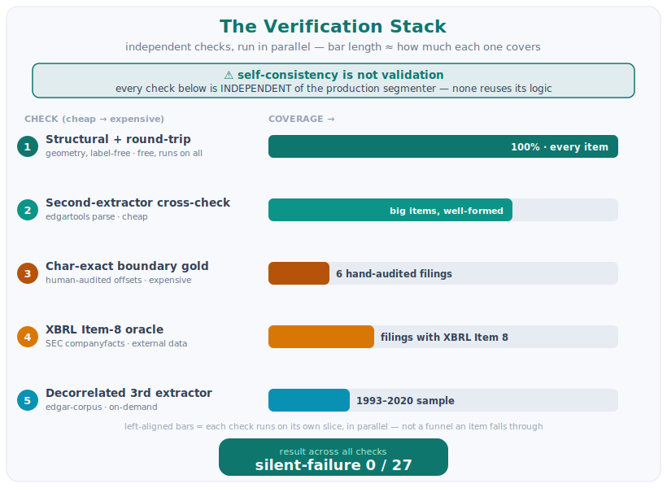

# Analysis — SEC 10-K Item Extractor

This report covers the four things the assignment asks an analysis report to address:
**runtime performance, cost, scalability, and how correctness is verified.** The last is the
hard one — there is no public answer key for 10-K item boundaries. System design and how to run
it live in the [README](README.md); this document is only the analysis.

*One-line recap (full design in README):* an item is a **character range** into the filing's
text, never model-generated. A deterministic rules tier segments ~100% of filings at **$0**, a
validation layer attaches a confidence and a status to every item, and an LLM tier is reserved
for the low-confidence minority (off by default — see [Cost](#2-cost)).

*Where the numbers come from:* `eval/run_eval.py` over a self-built **27-filing** set
(`eval/eval_set.json`, pinned by accession and immutable) plus the unit suite. The committed
`eval/report.md` is dated 2026-06-28. `edgartools` is version-pinned so the rendered text — and
the frozen boundary labels measured against it — stay reproducible. Reproduce with
`python eval/run_eval.py` and `python -m pytest -q`.

---

## 1. Runtime performance

The processing is sub-second; the only slow part is the EDGAR fetch, which is outside our
compute and is cached.

**Processing per filing is ~16 ms.** Measured network-free on all 27 eval filings (8.7 KB–1.28 MB
of canonical text, all three eras), median of 9 runs each, inputs served from the on-disk
`edgartools` cache with the socket layer hard-blocked so no fetch could leak into the timing:

| Stage (median across 27 filings) | Time |
|---|---|
| Segmentation (anchor passes) | **10.8 ms** |
| Validation (geometry + round-trip + bands + template) | **~5.2 ms** |
| **Segment + validate (the full offline item pipeline)** | **16.0 ms** (p95 37.4 ms) |
| Canonical text normalization | 37.5 ms |
| Full chain (normalize + segment + validate) | **56 ms** |

- **Throughput is ~63 filings/sec on one core** for segment+validate (~27 MB of filing text/sec),
  ~18 filings/sec including normalization. The largest filing in the set (Duke Energy FY2010,
  1.28 MB) still processes in **68 ms** — worst-case compute is under a tenth of a second.
- **Compute is O(n) and is not the bottleneck.** Segmentation is a few linear regex/anchor scans
  plus a span selection; validation is arithmetic on offsets plus cheap per-item checks; one
  filing in memory at a time.

**Running the eval set is parallelized across processes.** `eval/run_eval.py` uses a
`ProcessPoolExecutor` (`EVAL_WORKERS`, default 4); `.map` preserves input order so the report
stays stable and a per-filing failure is isolated. Measured by a live same-session A/B on 6
filings: **412.8 s sequential → 234.1 s with 4 processes = 1.8×** (a full 27-filing sequential
run is ~12 min). A first attempt with **threads gave 0.9×** — no speedup — because each filing is
tens of seconds of GIL-held work (the XBRL Item-8 oracle's concept search plus the big-document
parse) on top of `edgartools`' in-process-serialized HTTP, which one GIL cannot overlap; separate
processes do. The 1.8× ceiling (not 4×) is bounded by **SEC EDGAR's 10 req/s cap plus CPU
cores** — the network politeness limit, not our compute.

*Network fetch, the one slow part (aside).* End-to-end wall-clock per filing is dominated by the
EDGAR fetch + parse (~8–10 s for a typical iXBRL filing, more for a ~4 MB GE), not by the ~16 ms
of segmentation/validation above. That cost is outside our compute and is **cached by accession**
([§3](#3-scalability)), so repeat views, the demo set, and the eval harness return instantly; a
120 s per-request timeout bounds the cold-fetch tail with a graceful 504 + retry-from-cache.

## 2. Cost

The rules tier does the work; the paid model is the exception.

- **$0 inference on 100% of filings.** Regex/anchor segmentation plus the structural and XBRL
  checks make no paid model call. (This is a *cost* statement, not accuracy — accuracy is §4.)
- **The LLM tier runs only on the flagged minority, windowed.** A boundary is escalated only when
  it is not high-confidence; each call sees a ±2,000-char window (~1k tokens), never the whole
  filing. On the 27-filing ledger the gate flags 203 candidates total, concentrated in a few
  pathological filings — clean filings flag ~1–3 of 23 items.
- **If wired, ≈ $0.001–0.002 / filing** (blended; clean filings ≈ $0.0002), under the
  $0.003–0.006 target. The provider is the GitHub Copilot SDK, billed at a **flat-rate quota**, so
  the marginal dollar cost is ≈ 0; the real bounded resource is requests/quota + latency.
- **Measured on the real provider, not just estimated.** The committed ledger is the $0 deferred
  default (0 calls / 0 tokens); a live run against the Copilot SDK on `ko-fy2023` fired **3 calls
  at ~13k input tokens/call** — the Copilot CLI wraps each call in its agent harness, so input
  dwarfs the ~1k window prompt. (`research/llm-measurement-findings.md`.)
- **It is off by default because we measured it and it earned nothing:** on the audited gold the
  LLM moved **no boundary (ΔIoU 0.000)**; across the eval set 106 calls produced 2 moves, both on
  filings without gold. It is kept as an honest opt-in (a real Copilot call, per-request toggle),
  not a claimed win, not deleted.
- **Graceful $0 fallback.** With no Copilot token the tier records candidates only — 0 calls,
  0 tokens, measured not assumed — and the offline test suite stays network-free.
- **vs the naive baseline:** calling the model on every item would be 23 calls on a clean filing;
  escalate-only-flagged is 1 (−96%), on the boundaries that actually matter.

## 3. Scalability

"Scalability" here means three different things; the system is honest about each.

### (a) Runtime / throughput

- **Stateless, O(n) per filing.** Segmentation is one regex/anchor pass plus a span selection
  (`segment.py`); one filing in memory at a time, so workers are independent and scale
  horizontally. No shared mutable state across requests.
- **Cache by accession.** Filings are immutable, so results are memoised; the web API and eval
  harness share this (`api/server.py` keys by `accession|escalate|model`). Repeat views and the
  demo set are $0 and instant.
- **The cap is EDGAR politeness, not CPU/RAM.** A descriptive User-Agent + per-fetch network
  timeout (`ingest.py`) and the 120 s per-request extract timeout (§1) so a wedged fetch can't pin
  a worker. Throughput is bounded by SEC's 10 req/s, which is why the eval pool fans out to a
  modest few processes, not more.

### (b) Code extensibility — can the codebase absorb new cases?

Some seams are genuinely pluggable; others are honest coupling.

- **New independent check — clean.** Checks are separated by *source of truth* — tiling/round-trip
  arithmetic (`validate.py`), a second extractor (`boundary_crosscheck.py`), the XBRL/companyfacts
  oracle (`oracle.py`). `assess()` takes each as an argument; a new oracle is a new module + one
  OR-term in the `needs_review` clause. No rewrite.
- **New item type — clean.** Add one row to `CANONICAL_ITEMS` (`items.py`); order, classification,
  and template logic derive from it. Era/year rules live in one place (`template.expectation()`).
- **New escalation backend — clean.** `LLMClient` is a `Protocol` (`escalation.py`); a new
  provider implements `adjudicate()` and reports token usage. The default stub keeps the path $0.
- **New extractor tier — fairly clean.** The fallback (`fallback.py`) re-locates a second parser's
  items back into our offsets rather than copying them, so a new tier just produces
  `{key: (start, end)}` spans; the validation contract is uniform.
- **New format era — partial.** `detect_era()` (`normalize.py`) is a small if-ladder
  (sgml / html / ixbrl); a fourth era is one branch. But there is **no per-era handler dispatch** —
  every era flows through the same regex segmenter, so a new era only "scales" if its headers
  already match those regexes.
- **New header style — this is the real limit (surgery, not a plug-in).** `segment.py` carries a
  few shared module-level patterns and the recovery passes are hardcoded inline in `segment()`,
  not a registry. A genuinely new header shape (e.g. the no-separator `ITEM 1 BUSINESS`, §4.4)
  means editing a shared regex or appending another guarded pass — and every widen risks the
  byte-identical clean-filing guarantee. The deeper ceiling is architectural: **both extractors
  are header-anchored**, so a no-usable-header filing defeats both the same way. The documented
  fix (a non-header CRF) is out of scope; until then these filings are *flagged*, not extended
  into.

### (c) Eval toolchain — can `eval/` grow cheaply?

Yes; this scales better than the segmenter.

- **More filings — append-only, no code change.** `eval_set.json` is accession-pinned JSON;
  `run_eval.py` fans out with the `ProcessPoolExecutor` (§1) and isolates per-filing failures, so
  adding 100 filings cannot sink the run.
- **More sweep volume — already proven.** `structural_sweep.py` adds samples by a *new line-file*
  (`sweep_accessions.txt` → `sweep2_` → …); the report name auto-derives, with a hard-kill
  per-filing timeout and checkpoint/resume. It has run 1,656 filings; a fourth sweep is a new
  file, not a code edit.
- **New stratum — free.** Per-bucket tables come from a generic `_bucket` over whatever field
  exists on each row, so a new `sector`/`filer_type` value just adds a row, and a new *axis* is
  one field + one call.
- **Gold is human-only — the honest limit.** `boundary_gold.json` (8 filings) and
  `classification_gold.json` are pure data, accession-pinned, dated, and **read-only** in the
  harness (it reports the match rate, never writes or auto-freezes). That independence is the
  point — but it means *gold scales with human audit time, not compute*; a 150-filing boundary set
  stays a human-bound, not a tooling, ceiling.

## 4. How correctness is verified (no public answer key)

There is no filing-level ground truth for 10-K item boundaries, so the whole verification design
follows one rule: **self-consistency is not validation.** A check that reuses the segmenter's own
logic will pass even when the segmenter is confidently, systematically wrong. So every check below
is **independent of the production segmenter**, layered cheap (100% scope) → expensive (narrow
gold):



### 4.1 The eval set

27 filings, hand-picked to cover the axes a reviewer's own filings will hit — three format eras
(pre-2001 SGML, HTML, modern iXBRL), multiple sectors, and a dozen known-hard structures — each
pinned by accession. It is deliberately **not** a random sample, so its pass rate is a *coverage*
check, not a population estimate (the population number is the sweep in §3). 15 filings are
expected to extract cleanly; 12 are tracked as known-hard on purpose (§4.4).

### 4.2 Results

| Measure | Result | Scope |
|---|---|---|
| Presence recall, clean filings | **15/15 = 1.0** | the 15 non-hard filings |
| **Silent-failure rate** | **0/27** (95% CI 0.00–0.12) | every miss is flagged `needs_review`, never silent |
| Boundary accuracy (char-exact, IoU ≥ 0.9) | **match-rate 1.0, mean IoU 0.996–1.000** | 6 human-audited gold filings (iXBRL ×4, HTML ×1, SGML ×1) |
| Robustness on a diverse (non-curated) batch | **62% → 78%** after fixes (7/9) | the kind of batch a grader runs |

The boundary gold totals **8** filings; 6 are in the eval set (the floor above), 2 are off-set
fix-targets reported honestly as still-hard. Two of the six are *method-independent* (located by
reading the filing or by section title, not from the regex), so their agreement is a genuine
cross-method confirmation rather than the tool grading itself.

**Silent-failure rate is the headline metric**: the system is allowed to be wrong only when it
says so (`needs_review`). A silent failure = a missed item that was *not* flagged; there are none
on the eval set.

### 4.3 The independent checks (cheap → expensive)

Each is named by the file that implements it, and each can **refute** — a deliberately injected
error makes it fire, proven by a mutation test (`tests/test_*`).

| Check | What it proves | Why it's independent |
|---|---|---|
| Geometry + round-trip (`validate.py`) | items don't overlap, cover the body, and rebuild it byte-for-byte | pure arithmetic on offsets — uses no labels |
| Second-extractor agreement (`boundary_crosscheck.py`) | a different parser agrees on each boundary | uses edgartools' own item parse. *Limit:* both are header-based, so it abstains where both would fail the same way |
| Char-exact boundary gold (`evalkit.py` ↔ `boundary_gold.json`) | the boundary is *right*, not just present | human-audited offsets, frozen, never written by the loop |
| XBRL Item-8 oracle (`oracle.py`) | tagged financial facts fall inside Item 8 | data comes from the SEC companyfacts API, never our own output |
| Third, decorrelated extractor (`edgar_corpus_spike.py`, on-demand) | breaks the "both header-parsers fail together" blind spot | an unrelated open toolkit — e.g. it caught an edgartools boundary outlier on Exxon FY2010 |
| Classification check (`classification_gold.json`) | present / legitimately-absent / failure is labelled right | a separate human-audited reference that still catches real errors it doesn't copy |
| Mutation battery (`tests/`) | the checks themselves actually fire | injects swallow / merge / swap faults and asserts each is caught |

A consequence of this design: a fix is kept only when one of these **independent** checks
improves while the controls stay unchanged — we explicitly refused to make a change "pass" by
loosening a check it was measured against.

### 4.4 What it can't do yet (honest list)

Every case below is **flagged** (`needs_review`) — never a silent wrong answer. Concrete filings
and detail are in `research/`.

| Case | Example | Why it fails | Status |
|---|---|---|---|
| Glued `PART I ITEM 1.` line | Walmart FY2003 | the joined `PART I` prefix defeats the line-start anchor → Item 1 dropped | flagged; fix scoped |
| Labels exist only in stripped styling | Morgan Stanley FY2024 | "Item N" lives in iXBRL styling that flattens away → both extractors find 0 items | **the one case unfixable in scope** |
| No separator in the header | Honeywell FY2024 | `ITEM 1 About…` (no `.` / `:`) → the header regex finds nothing | flagged; fix risky |
| Cross-reference-index house-style | GE / Intel FY2018 | the body has no item headings at all; only an end-of-document index table maps item → page (~1% of filings) | flagged; needs a non-header model |
| Tolerant-split over-drop | ~1.8% of filings | an in-prose "see Item 8" makes the relaxed pass skip a real item (usually Item 7A) | flagged; deferred (low gain, high risk) |
| Scattered / dropped lead item | JPMorgan Item 7; Bank of America | a pointer-stub MD&A, or run-fragmentation that drops Items 1 & 7 | flagged; tracked |
| Wrong filing selected | 374Water | a ticker+year lookup can return the 10-K/A amendment instead of the 10-K | flagged; eval pins by accession |

The recurring root cause is that **both extractors are header-based**, so a filing with no usable
"Item N" text defeats both the same way. The documented fix for that class is a decorrelated,
non-header sequence model (a CRF) — large effort, out of this build's scope, and the honest reason
the system **flags** these filings instead of guessing.

### 4.5 On the confidence bands (honest scoping)

Every item carries a band — HIGH / MEDIUM / LOW — but the band is a **rule-derived label, not a
statistically calibrated probability.** The rule is explicit in `validate.py` (`_band_present`): a
present item is HIGH only when *both* independent per-item signals agree (keyword content **and**
the title sitting at the item's start), MEDIUM if either is missing, and LOW when a filing-level
structural or coverage check breaks; the XBRL Item-8 oracle and the second-extractor cross-check
can each demote a HIGH to MEDIUM. The numeric score (0.9 / 0.6 / 0.3) is a display weight, not a
measured precision. **What is actually validated is the binary `needs_review` gate, not the
three-way band** — `needs_review` fires on any independent problem signal and is the
silent-failure metric in §4.2 (0/27). We do **not** separately measure per-band precision/recall,
so we make no calibration claim; the documented stretch is conformal prediction stratified per
format era (Mondrian), which would turn the band into a guaranteed prediction set — out of this
build's scope.

### 4.6 How fixes were accepted

The project ran an eval-driven improvement loop, but kept a change only when an independent check
moved while controls held. For example, a form-aware amendment fix was **discarded** in one round
— its only gain was on a metric it could trivially move — and **re-earned** later once a separate
human-audited classification reference could actually see the improvement. Round-by-round detail
is in `research/round-*-findings.md`.

---

## Reproduce

```bash
python -m pytest -q                 # 101 tests (100 pass, 1 skipped) — network-free
SEC_EDGAR_USER_AGENT="Name email" python eval/run_eval.py   # regenerates eval/report.md
```

Boundary-gold provenance and the human-audit record:
`eval/boundary_gold.json` and `prompts/2026-06-24-*-record-human-audit-of-boundary-gold.md`.
